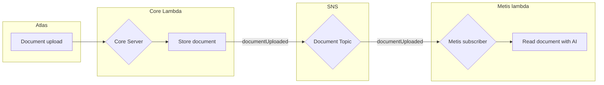
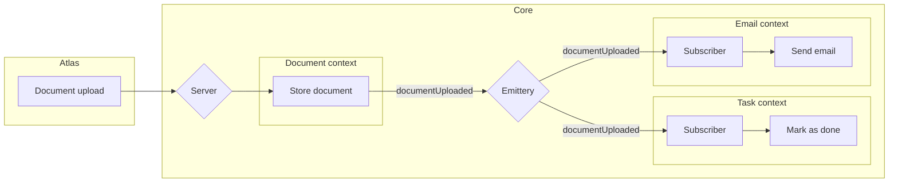

---
# You can also start simply with 'default'
theme: seriph
# random image from a curated Unsplash collection by Anthony
# like them? see https://unsplash.com/collections/94734566/slidev
background: https://cover.sli.dev
# some information about your slides (markdown enabled)
title: Communication par events asynchrones
# apply unocss classes to the current slide
class: text-center
# https://sli.dev/features/drawing
drawings:
  persist: false
# slide transition: https://sli.dev/guide/animations.html#slide-transitions
transition: slide-left
# enable MDC Syntax: https://sli.dev/features/mdc
mdc: true
---

# Communication par events asynchrones

Mode d'emploi chez Ovrsea

<!--
Notes
-->

---
layout: two-cols
---

# Opération Synchrone

Bloquant et impactant

```ts {monaco-run} {autorun:false}
const sendEmail = async () => {
  await new Promise(res => setTimeout(res, 2000));
  console.log("Email sent")
}

// Create shipment mutation resolver

console.log("Create shipment")
await sendEmail()
console.log("Done")
```

::right::

# Opération Asynchrone

Non bloquant mais impactant
```ts {monaco-run} {autorun:false}
const sendEmail = async () => {
  await new Promise(res => setTimeout(res, 2000));
  console.log("Email sent")
}

// Create shipment mutation resolver

console.log("Create shipment")
sendEmail();
console.log("Done")

```

<!--
- Les appels synchrones bloquent le code
- L'asynchrone permet de gagner du temps, ex en front ou avec des opérations qui ne sont pas core
- Dans les 2 cas, la fonction appelée peut throw, et son domaine leak alors qu'on a pas forcément envie
-->

---
layout: image-right
image: https://cover.sli.dev
---

# Evenement Asynchrone

Code non bloquant et impact délégué
```ts
// Create shipment mutation resolver

console.log("Create shipment")
emit("shipmentCreated")
console.log("Done")
```

<!--
- Littéralement "j'ai fais ça, démerdez vous avec"
-->

---


# Events, Event Driven Development

- Excellent moyen de découpler le métier et de produire une architecture scalable
```ts
// core/tracking/updateTracking.ts

emit("shipmentDeparted")
// Le tracking n'a que faire de mettre à jour les status, les tâches, les emails, etc
```

- Permettent de lancer des commandes
```ts
// Pour du découplage plus technique 
on("EMAIL_SendBookingRequestAskedEmailCommand", (payload) => sendBookingRequestEmail(payload.shipmentId))

// Pour se simplifier la vie lors d'opérations manuelles
on("resyncTracking", (payload) => resyncTracking(payload.shipmentId))
```

- Nécessité de stocker les messages (Event Log) pour remonter le fil d'exécution


---


# SNS

- Solution AWS
- Permet de trigger les composants d'une architecture distribuée
- Rien à implémenter
- Intégration naturelle avec l'écosystème AWS

<br>
<br>
<br>




---


# Emittery

- Librairie JS Open-Source
- Monolithe modulaire: SNS n'a plus de sens pour tout ce qui ne regarde pas l'architecture distribuée
- Plus léger, plus rapide (pas de broker de messages, rien de distribué)
- Solution plus personnalisable et controlable

<br>
<br>
<br>



---
layout: image-right
image: https://cover.sli.dev
---

# Gestion des erreurs

- Tous les messages sont sauvegardés dans une db
- En cas d'erreur, retry auto
- Rejouabilité à la main ou via Retool par exemple


---
layout: image-right
image: https://cover.sli.dev
---

# Types de subscriber

- Possible de subscribe de 3 façons:
  - Async: le publisher resolve immédiatement
  - Sync: le publisher ne resolve que quand le subscriber resolve
  - Serial: Async mais les subscribers sont executés en série et non pas en parallèle

---
layout: image-right
image: https://cover.sli.dev
---

# Code dives

- Core de notre implem emittery
- Exemples de publish/subscribes
- DB des messages
- Command runner et rejouabilité

<!--
- subscribers sync: microservices/core/services/orders/api/subscriber.ts
- subscribers serial:  microservices/salesforce/src/handlers/atlasToSalesforce.ts (pb de concurrence avec l'API SF)
-->
