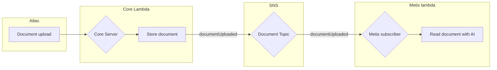
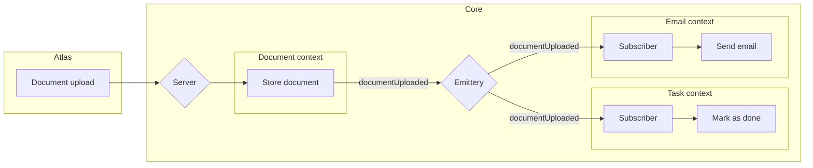

---
# You can also start simply with 'default'
theme: seriph
# random image from a curated Unsplash collection by Anthony
# like them? see https://unsplash.com/collections/94734566/slidev
background: https://cover.sli.dev
# some information about your slides (markdown enabled)
title: Communication par events asynchrones
# apply unocss classes to the current slide
class: text-center
# https://sli.dev/features/drawing
drawings:
  persist: false
# slide transition: https://sli.dev/guide/animations.html#slide-transitions
transition: slide-left
# enable MDC Syntax: https://sli.dev/features/mdc
mdc: true
---

# Communicating with async events
At OVRSEA
<!--
Notes
-->

---
layout: two-cols
---

# Sync operation
Blocks the execution and couples the implementation

```ts {monaco-run} {autorun:false}
const sendEmail = async () => {
  await new Promise(res => setTimeout(res, 2000));
  console.log("Email sent")
}

// Create shipment mutation resolver

console.log("Create shipment")
await sendEmail()
console.log("Done")
```

::right::

# Async operation
Doesn't block the execution but couples the implementation
```ts {monaco-run} {autorun:false}
const sendEmail = async () => {
  await new Promise(res => setTimeout(res, 2000));
  console.log("Email sent")
}

// Create shipment mutation resolver

console.log("Create shipment")
sendEmail();
console.log("Done")

```

<!--
- Les appels synchrones bloquent le code
- L'asynchrone permet de gagner du temps, ex en front ou avec des opérations qui ne sont pas core
- Dans les 2 cas, la fonction appelée peut throw (ou pas), et son domaine leak alors qu'on a pas forcément envie
-->

---
layout: image-right
image: https://cover.sli.dev
---

# Async event

Non blocking and no implementation
```ts
// Create shipment mutation resolver

console.log("Create shipment")
emit("shipmentCreated")
console.log("Done")
```

<!--
- Littéralement "j'ai fais ça, démerdez vous avec"
-->

---


# Events, Event Driven Development

- Excellent way to decouple contexts, and produce scalable code
```ts
// core/tracking/updateTracking.ts

emit("shipmentDeparted")
// Tracking doesn't care about updating statuses, tasks, emails, etc
```

- Allow to launch commands
```ts
// Avoids technical coupling
on("EMAIL_SendBookingRequestAskedEmailCommand", (payload) => sendBookingRequestEmail(payload.shipmentId))

// Simplifies manual tech operations
on("resyncTracking", (payload) => resyncTracking(payload.shipmentId))
```

- Need to store an event log to keep track of the history


---


# SNS

- AWS Solution
- Allows to trigger the components of a distributed architecture
- Nothing to implement
- Natural integration with AWS ecosystem

<br>
<br>
<br>



```mermaid {theme: 'neutral', scale: 0.5}
flowchart LR

  subgraph Atlas
    DocumentUpload[Document upload]
  end

  subgraph Core Lambda
    DocumentUpload --> CoreServer{Core Server}
    CoreServer --> StoreDocument[Store document]
  end

  subgraph SNS
    StoreDocument -->|documentUploaded| DocumentTopic{Document Topic}
  end

  subgraph Metis lambda
    DocumentTopic -->|documentUploaded| MetisSubscriber{Metis subscriber}
    MetisSubscriber --> AiRead[Read document with AI]
  end
```

---


# Emittery

- Open source JS lib
- Modular monolith: SNS makes no sens now that our architecture is not distributed anymore
- Lighter, faster, (no message broker, no network calls)
- More customisable, more control

<br>
<br>
<br>


```mermaid {theme: 'neutral', scale: 0.57}
flowchart LR
  subgraph Atlas
    Upload[Document upload]
  end
  subgraph Core
    Server{Server}
    Emittery{Emittery}

    Upload --> Server
    Server --> StoreDocument
    StoreDocument -->|documentUploaded| Emittery
    Emittery -->|documentUploaded| TaskSubscriber
    Emittery -->|documentUploaded| EmailSubscriber

      subgraph Document context
        StoreDocument[Store document]       
      end

      subgraph Task context
        TaskSubscriber[Subscriber]
        ValidateUploadTask[Mark as done]

        TaskSubscriber --> ValidateUploadTask
      end

      subgraph Email context
        EmailSubscriber[Subscriber]
        SendDocumentEmail[Send email]

        EmailSubscriber --> SendDocumentEmail
      end

  end
  
```

---
layout: image-right
image: https://cover.sli.dev
---

# Error handling

- All event messages are saved into a DB
- Auto-retry when error
- Replayability

---
layout: image-right
image: https://cover.sli.dev
---

# Subscriber types

- 3 ways to subscribe:
  - Async: publisher resolvers immediatly
  - Sync: publisher waits for subscribers to resolve
  - Serial: Async but subscriber are executed in series instead of parallel
---
layout: image-right
image: https://cover.sli.dev
---

# Code dives

- Core implementation
- Publish/subscribes examples
- Messages database
- Command runner, replay

<!--
- subscribers sync: microservices/core/services/orders/api/subscriber.ts
- subscribers serial:  microservices/salesforce/src/handlers/atlasToSalesforce.ts (pb de concurrence avec l'API SF)
-->
